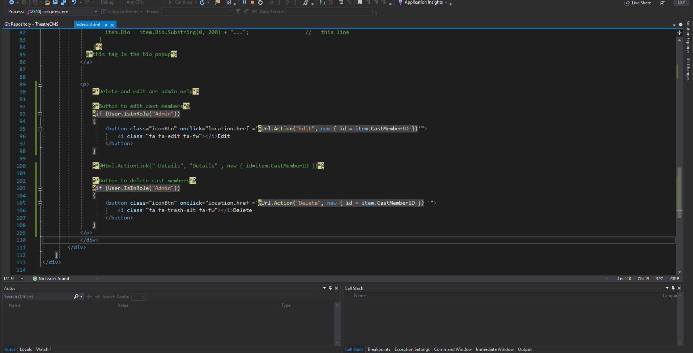
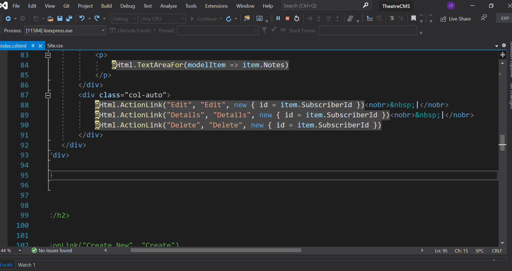
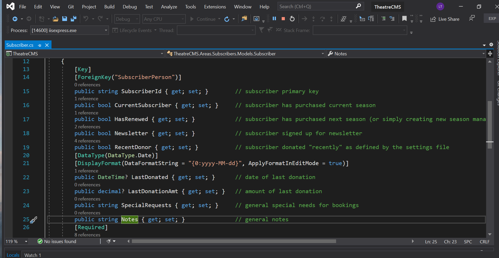
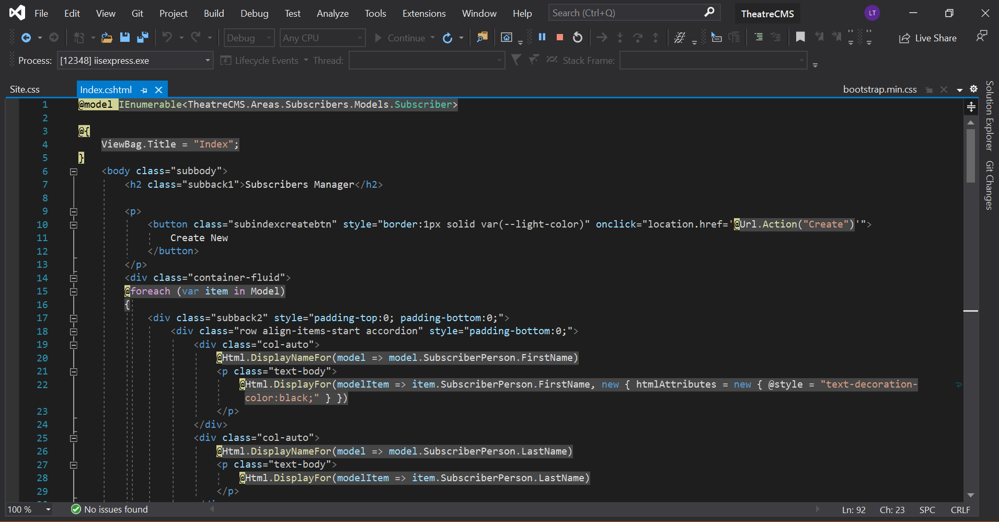

# Live-Project-Summary
During a two week period, I was assigned to work on a large scale web application project. The application was being designed to manage the contents of a movie theater website. This web application was built using the ASP.Net Framework and the Entity Frame Work. I was assigned several task that which included changing some features of the website. One of the tasks was to change the links to buttons using Razor Syntax on the cast member’s page. The other task was to change links to buttons and also change the appearance of the buttons to match the design of the subscriber’s page. Throughout, the project I got to work with HTML, CSS, Razor, C# and more to make the requested changes and additions. Every day we had a standup meeting to share with each other what we did yesterday, what we are planning to do today, and what, if any obstacles were encountered and how were they resolved or what needs to be resolved. The two week project was run using the Agile/Scrum methodology principles during the sprint cycle.

Here is a link to the source code of the files worked on: 
Below is a more detailed explanation of the stories assigned and the progression as I was tackling one problem at time. 

The first task that I was assigned was to changed the links to buttons on the Cast members page. Here I had to use Razor syntax in order to achieve the desired outcome.  Even though I was new to Razor syntax, with a little bit of research I was able to figure out the syntax and how it works and got the job done. Below are snippets of before and after with corresponding code.

Before Change:

Before Change Code: 

After Change:

 
After Change Code:

 
Before Change: 

Before Change Code:

After Change:

 
After Change Code:

My second task was to redesign the Subscriber page. I had to remove an unnecessary link, delete vertical lines between edit, delete, and details links. Change links into buttons with matching design and coloring. Ensure that all buttons work smoothly and beautifully. I added some spacing between the title headings in the table for ease of reading and for a more professional look. Below are pictures and snippets of before and after code and webpage itself.

Before Change: 

Before Code:

 

After Change:

After Code:

 
 
 
